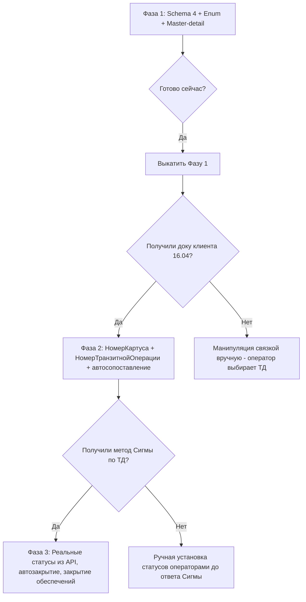
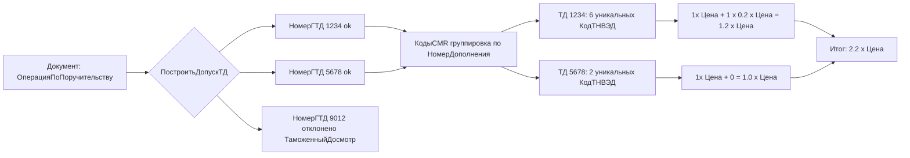

# Архитектура логики Транзитных Деклараций (ТД)

Расширение: `Русский_Транзит` (CFE) для 1С:УТ 11
Документ: `ОперацияПоПоручительству`
Модуль расчёта: `CommonModules/исРасчет/Ext/Module.bsl`
Дата: 2026-04-23
Автор: 1c-code-architect (Claude Opus 4.7)

---

## 1. Executive summary

Логика ТД в расширении «Русский_Транзит» имеет три критические проблемы, мешающие корректному расчёту цены обеспечения и ТД:

1. **Bug Schema 4** — в `РассчитатьОформлениеТД` и `РассчитатьКоличествоДопCMR` агрегирование кодов идёт по всей ТЧ `КодыCMR`, а не по каждой ТД отдельно. Это даёт ложные «бесплатные» лимиты для ТД, у которых уникальных кодов меньше 3, и ложные переполнения для ТД, у которых >5 кодов. Требование из `Логика_ТД_Схемы.md` (Схема 4) — считать уникальные **КодТНВЭД** **на каждую ТД** (группировка по `НомерДополнения = НомерГТД = MSS_GUARANTEEREGNUM`).
2. **Отсутствует статус ТаможенныйДосмотр** — перечисление `СтатусыТранзита` содержит 12 значений, но не включает `ТаможенныйДосмотр`. По схеме 2 FSM (Зарегистрировано / Выпуск / ТранзитЗавершён / ТаможенныйДосмотр / БезВыпуска) он обязателен, а расчёт должен исключать ТД в статусе ТаможенныйДосмотр и БезВыпуска (= `ТоварНеВыпущен`) из базы для деления «за ТД».
3. **Отсутствует мастер-деталь на форме** — ТЧ `КодыCMR` не фильтруется при активизации строки `ДанныеДокументов`. Пользователь видит всю «кашу» и не понимает, какие CMR относятся к выделенной ТД.

Ключевое ограничение: **поле `КодТНВЭД` отсутствует в ТЧ `КодыCMR`**, хотя именно оно — первичный ключ уникальности по Схеме 4. Его необходимо добавить в метаданные и импорт из Сигмы (сейчас в APIСигма не заполняется — в CSV Сигмы нет этого поля).

Фикс П-04 (неправильные индексы `НомераCMR` / `НомерЭТД` в APIСигма) **уже выполнен** 2026-04-07 (см. `epf/APIСигма/APIСигма/Forms/Форма/Ext/Form/Module.bsl` строки 639-642 и 708-712) — `НомераCMR = [38]` (TDOC_NUMBER), `НомерЭТД = [76]` (MSS_DECLREGNUM).

Решение катим в три фазы:

| Фаза | Триггер | Задачи |
|------|---------|--------|
| 1 | Сейчас (не блокируется) | Enum ТаможенныйДосмотр, Schema 4 в расчёте, мастер-деталь на форме, status-filter, линт и верификация |
| 2 | Документ клиента от 16.04 (связка обеспечение↔ТД) | НомерКартуса, НомерТранзитнойОперации, автоматическое сопоставление ОбПоручительство↔ТД |
| 3 | Метод Сигмы по ТД (блокер на уровне руководителей) | Реальная подгрузка статусов, дат завершения, расчёт по фактическим данным ТД |

В документе ниже — полные XML-фрагменты метаданных, переписанные BSL-процедуры, форма, план тестирования (BSL Lint + MCP Toolkit порт 6003 + YAxUnit), риски и чек-лист.

---

## 2. Diff метаданных (XML)

Все изменения — в `src/cfe/Русский_Транзит/`. Изменения только аддитивные: новое значение перечисления + новый реквизит ТЧ. Обратная совместимость сохраняется.

### 2.1 Добавить значение перечисления СтатусыТранзита.ТаможенныйДосмотр

Файл: `Enums/СтатусыТранзита.xml`

Вставка внутри `<ChildObjects>` после `<EnumValue>` с именем `ТоварНеВыпущен`:

```xml
<EnumValue uuid="d5c3e2a1-7f8b-4e3c-9a2d-1b4f5c6e7a8b">
    <Name>ТаможенныйДосмотр</Name>
    <Synonym>
        <key>ru</key>
        <value>Таможенный досмотр</value>
    </Synonym>
    <Comment/>
</EnumValue>
```

UUID выбран случайно из диапазона, проверить отсутствие коллизий через `Grep uuid=d5c3e2a1` по всему расширению.

### 2.2 Добавить реквизит КодТНВЭД в ТЧ КодыCMR

Файл: `Documents/ОперацияПоПоручительству.xml`

Вставка внутри `<TabularSection>` с именем `КодыCMR` (текущее расположение ~2626-3183), после `<Attribute>` с именем `НомерДополнения`:

```xml
<Attribute uuid="b7a8f91c-5d6e-4a2f-bc34-1e2d3f4a5b6c">
    <Name>КодТНВЭД</Name>
    <Synonym>
        <key>ru</key>
        <value>Код ТН ВЭД</value>
    </Synonym>
    <Comment/>
    <Type>
        <v8:Type>xs:string</v8:Type>
        <v8:StringQualifiers>
            <v8:Length>20</v8:Length>
            <v8:AllowedLength>Variable</v8:AllowedLength>
        </v8:StringQualifiers>
    </Type>
    <PasswordMode>false</PasswordMode>
    <Format/>
    <EditFormat/>
    <ToolTip>
        <key>ru</key>
        <value>Код ТН ВЭД товара. Используется для подсчёта уникальных кодов в ТД (Схема 4).</value>
    </ToolTip>
    <MarkNegatives>false</MarkNegatives>
    <Mask/>
    <MultiLine>false</MultiLine>
    <ExtendedEdit>false</ExtendedEdit>
    <FillFromFillingValue>false</FillFromFillingValue>
    <FillValue xsi:type="core:UndefinedValue"/>
    <FillChecking>DontCheck</FillChecking>
    <ChoiceFoldersAndItems>Items</ChoiceFoldersAndItems>
    <ChoiceParameterLinks/>
    <QuickChoice>DontUse</QuickChoice>
    <CreateOnInput>Use</CreateOnInput>
    <ChoiceForm/>
    <LinkByType/>
    <ChoiceHistoryOnInput>Auto</ChoiceHistoryOnInput>
</Attribute>
```

UUID проверить на уникальность через `Grep uuid=b7a8f91c`.

**Важно**: Сигма сейчас НЕ отдаёт `КодТНВЭД`. До появления в API поле заполняется вручную оператором. Для корректности расчёта (Схема 4) рекомендую валидацию в `ОбновитьЦеныНаСервере`: если в ТД (по `НомерДополнения`) нет ни одного заполненного `КодТНВЭД`, fallback — считать каждую строку `КодыCMR` как уникальный код (текущее поведение), но вывести предупреждение в журнал регистрации через `ЗаписьЖурналаРегистрации`.

### 2.3 Форма: добавить событие OnActivateRow для ТЧ ДанныеДокументов

Файл: `Documents/ОперацияПоПоручительству/Forms/ФормаДокумента/Ext/Form.xml`

В элементе `<ChildItems>` для табличной части `ДанныеДокументов` добавить внутри элемента `<Table>`:

```xml
<Events>
    <Event name="OnActivateRow">ДанныеДокументовПриАктивизацииСтроки</Event>
</Events>
```

Имя обработчика — `ДанныеДокументовПриАктивизацииСтроки` (реализация в п. 4).

---

## 3. Diff BSL в CommonModules/исРасчет/Ext/Module.bsl

### 3.1 Новая функция ПостроитьДопускТД

Вставить **после** существующей функции `ПостроитьДопускCMR` (после строки 929):

```bsl
// Строит соответствие "НомерГТД -> Истина" для ТД, которые УЧАСТВУЮТ в расчёте.
// Исключаются:
//   * строки ДанныеДокументов с ТипУчета = ТолькоОбеспечение (ТД не оформлялась)
//   * строки со статусом ТаможенныйДосмотр или ТоварНеВыпущен (обеспечение возвращено/товар не выпущен)
//
// Параметры:
//   Объект - ДокументОбъект.ОперацияПоПоручительству
//
// Возвращаемое значение:
//   Соответствие - ключ: НомерГТД (строка), значение: Истина
//
Функция ПостроитьДопускТД(Объект) Экспорт
    Результат = Новый Соответствие;
    Для Каждого СтрокаДД Из Объект.ДанныеДокументов Цикл
        Если СтрокаДД.ТипУчета = Перечисления.ТипыУчетаПоПоручительству.ТолькоОбеспечение Тогда
            Продолжить;
        КонецЕсли;
        Если СтрокаДД.СтатусТранзита = Перечисления.СтатусыТранзита.ТаможенныйДосмотр
            Или СтрокаДД.СтатусТранзита = Перечисления.СтатусыТранзита.ТоварНеВыпущен Тогда
            Продолжить;
        КонецЕсли;
        Ключ = СокрЛП(СтрокаДД.НомерГТД);
        Если Ключ = "" Тогда
            Продолжить;
        КонецЕсли;
        Результат.Вставить(Ключ, Истина);
    КонецЦикла;
    Возврат Результат;
КонецФункции
```

### 3.2 Обновить ПостроитьДопускCMR — добавить фильтр по статусу

Старая версия (строки 921-929):

```bsl
Функция ПостроитьДопускCMR(Объект) Экспорт
    Результат = Новый Соответствие;
    Для Каждого СтрокаДД Из Объект.ДанныеДокументов Цикл
        Если СтрокаДД.ТипУчета <> Перечисления.ТипыУчетаПоПоручительству.ТолькоТД Тогда
            Результат.Вставить(СтрокаДД.НомерГТД, Истина);
        КонецЕсли;
    КонецЦикла;
    Возврат Результат;
КонецФункции
```

Новая версия (те же строки):

```bsl
// Строит соответствие "НомерГТД -> Истина" для CMR, которые УЧАСТВУЮТ в расчёте обеспечения.
// Исключаются:
//   * строки ДанныеДокументов с ТипУчета = ТолькоТД (обеспечение не выпускалось)
//   * строки со статусом ТаможенныйДосмотр или ТоварНеВыпущен (обеспечение возвращено/товар не выпущен)
//
Функция ПостроитьДопускCMR(Объект) Экспорт
    Результат = Новый Соответствие;
    Для Каждого СтрокаДД Из Объект.ДанныеДокументов Цикл
        Если СтрокаДД.ТипУчета = Перечисления.ТипыУчетаПоПоручительству.ТолькоТД Тогда
            Продолжить;
        КонецЕсли;
        Если СтрокаДД.СтатусТранзита = Перечисления.СтатусыТранзита.ТаможенныйДосмотр
            Или СтрокаДД.СтатусТранзита = Перечисления.СтатусыТранзита.ТоварНеВыпущен Тогда
            Продолжить;
        КонецЕсли;
        Ключ = СокрЛП(СтрокаДД.НомерГТД);
        Если Ключ = "" Тогда
            Продолжить;
        КонецЕсли;
        Результат.Вставить(Ключ, Истина);
    КонецЦикла;
    Возврат Результат;
КонецФункции
```

### 3.3 Рерайт РассчитатьОформлениеТД — Schema 4 RIGHT

Старая версия (строки 864-911, bug Schema 4 WRONG — агрегация по всему документу):

```bsl
Функция РассчитатьОформлениеТД(Объект, Цена) Экспорт
    Если Цена = 0 Тогда Возврат 0; КонецЕсли;
    ДопускТД = ПостроитьДопускТД(Объект);  // сейчас этой функции нет
    УникальныеКоды = Новый Соответствие;
    Для Каждого СтрокаCMR Из Объект.КодыCMR Цикл
        Если ДопускТД.Получить(СтрокаCMR.НомерДополнения) = Неопределено Тогда Продолжить; КонецЕсли;
        УникальныеКоды.Вставить(СтрокаCMR.КодТНВЭД, Истина);  // агрегация по всему документу - BUG
    КонецЦикла;
    КоличествоКодовВсего = УникальныеКоды.Количество();
    Превышение = Макс(0, КоличествоКодовВсего - 5);  // Bug - делает одно общее переполнение
    Возврат Цена * ДопускТД.Количество() + Превышение * Цена * 0.2;
КонецФункции
```

Новая версия (Schema 4 RIGHT — per-ТД базовая цена × количество ТД + per-ТД доплата за >5 кодов):

```bsl
// Рассчитывает стоимость оформления ТД по Схеме 4 (per-ТД):
//   * Базовая цена = Цена × КоличествоТД (где ТД - уникальные НомерГТД после ПостроитьДопускТД).
//   * Доплата за превышение лимита - ПО КАЖДОЙ ТД отдельно:
//     если уникальных КодТНВЭД в ТД > 5, то (КоличествоКодов - 5) × Цена × 0.2.
//   * Если КодТНВЭД в ТД вообще не заполнен - fallback: считаем каждую строку КодыCMR уникальным кодом.
//
// Параметры:
//   Объект - ДокументОбъект.ОперацияПоПоручительству
//   Цена   - Число - цена за ТД (из тарифной сетки или спеццены)
//
// Возвращаемое значение:
//   Число - общая стоимость оформления ТД по документу
//
Функция РассчитатьОформлениеТД(Объект, Цена) Экспорт
    Если Цена = 0 Тогда
        Возврат 0;
    КонецЕсли;

    ДопускТД = ПостроитьДопускТД(Объект);
    Если ДопускТД.Количество() = 0 Тогда
        Возврат 0;
    КонецЕсли;

    // Группировка кодов по ТД: КодыПоТД[НомерГТД] = Соответствие уникальных КодТНВЭД
    КодыПоТД = Новый Соответствие;
    Для Каждого ДопускКлючЗнач Из ДопускТД Цикл
        КодыПоТД.Вставить(ДопускКлючЗнач.Ключ, Новый Соответствие);
    КонецЦикла;

    // СчётчикСтрокПоТД - для fallback, когда КодТНВЭД пустой во всей ТД
    СчётчикСтрокПоТД = Новый Соответствие;
    Для Каждого ДопускКлючЗнач Из ДопускТД Цикл
        СчётчикСтрокПоТД.Вставить(ДопускКлючЗнач.Ключ, 0);
    КонецЦикла;
    ФлагПустогоКодаПоТД = Новый Соответствие;
    Для Каждого ДопускКлючЗнач Из ДопускТД Цикл
        ФлагПустогоКодаПоТД.Вставить(ДопускКлючЗнач.Ключ, Ложь);
    КонецЦикла;

    Для Каждого СтрокаCMR Из Объект.КодыCMR Цикл
        Ключ = СокрЛП(СтрокаCMR.НомерДополнения);
        Если Ключ = "" Или ДопускТД.Получить(Ключ) = Неопределено Тогда
            Продолжить;
        КонецЕсли;
        СчётчикСтрокПоТД.Вставить(Ключ, СчётчикСтрокПоТД.Получить(Ключ) + 1);
        КодТНВЭД = СокрЛП(СтрокаCMR.КодТНВЭД);
        Если КодТНВЭД = "" Тогда
            ФлагПустогоКодаПоТД.Вставить(Ключ, Истина);
            Продолжить;
        КонецЕсли;
        КодыЭтойТД = КодыПоТД.Получить(Ключ);
        КодыЭтойТД.Вставить(КодТНВЭД, Истина);
    КонецЦикла;

    // Базовая цена - за каждую ТД
    Результат = Цена * ДопускТД.Количество();

    // Per-ТД overflow
    Для Каждого ЭлементТД Из ДопускТД Цикл
        НомерТД = ЭлементТД.Ключ;
        КоличествоКодовТД = КодыПоТД.Получить(НомерТД).Количество();
        // fallback, если код не заполнен ни в одной строке этой ТД
        Если КоличествоКодовТД = 0 И ФлагПустогоКодаПоТД.Получить(НомерТД) = Истина Тогда
            КоличествоКодовТД = СчётчикСтрокПоТД.Получить(НомерТД);
            ЗаписьЖурналаРегистрации(
                "исРасчет.РассчитатьОформлениеТД",
                УровеньЖурналаРегистрации.Предупреждение,
                ,
                Объект.Ссылка,
                "КодТНВЭД не заполнен в ТД " + НомерТД + ", fallback по количеству строк CMR = " + КоличествоКодовТД);
        КонецЕсли;
        ПревышениеТД = Макс(0, КоличествоКодовТД - 5);
        Результат = Результат + ПревышениеТД * Цена * 0.2;
    КонецЦикла;

    Возврат Результат;
КонецФункции
```

### 3.4 Рерайт РассчитатьКоличествоДопCMR — per-ТД overflow

Старая версия (строки 834-850, bug — overflow на строке, а не на ТД):

```bsl
Функция РассчитатьКоличествоДопCMR(Объект) Экспорт
    Результат = 0;
    ДопускCMR = ПостроитьДопускCMR(Объект);
    Для Каждого СтрокаCMR Из Объект.КодыCMR Цикл
        Если ДопускCMR.Получить(СтрокаCMR.НомерДополнения) = Неопределено Тогда Продолжить; КонецЕсли;
        ПревышениеСтроки = Макс(0, СтрокаCMR.КоличествоКодов - 3);
        Результат = Результат + ПревышениеСтроки;
    КонецЦикла;
    Возврат Результат;
КонецФункции
```

Новая версия (per-ТД группировка, лимит 3 кода на ТД):

```bsl
// Рассчитывает количество "дополнительных CMR" для расчёта надбавки:
//   * Группируем по ТД (НомерДополнения).
//   * Для каждой ТД: сумма (КоличествоКодов) по всем строкам этой ТД - 3. Нижняя граница 0.
//   * Возвращаем суммарный overflow по всем ТД документа.
//
// Почему per-ТД, а не per-row:
//   Одна ТД может содержать несколько CMR (несколько строк КодыCMR с одним НомерДополнения).
//   Лимит в 3 кода - на всю ТД, а не на одну строку.
//
Функция РассчитатьКоличествоДопCMR(Объект) Экспорт
    ДопускCMR = ПостроитьДопускCMR(Объект);
    Если ДопускCMR.Количество() = 0 Тогда
        Возврат 0;
    КонецЕсли;

    КодыПоТД = Новый Соответствие;
    Для Каждого ДопускКлючЗнач Из ДопускCMR Цикл
        КодыПоТД.Вставить(ДопускКлючЗнач.Ключ, 0);
    КонецЦикла;

    Для Каждого СтрокаCMR Из Объект.КодыCMR Цикл
        Ключ = СокрЛП(СтрокаCMR.НомерДополнения);
        Если Ключ = "" Или ДопускCMR.Получить(Ключ) = Неопределено Тогда
            Продолжить;
        КонецЕсли;
        Текущее = КодыПоТД.Получить(Ключ);
        КодыПоТД.Вставить(Ключ, Текущее + СтрокаCMR.КоличествоКодов);
    КонецЦикла;

    Результат = 0;
    Для Каждого ЭлементТД Из КодыПоТД Цикл
        Результат = Результат + Макс(0, ЭлементТД.Значение - 3);
    КонецЦикла;

    Возврат Результат;
КонецФункции
```

### 3.5 Early-status-filter (отказ от опасной «ранней» оптимизации)

В задании предлагалось «если все строки исключены — ранний return». Отвергаем: это ломает смешанные документы (часть ТД активна, часть в ТаможенныйДосмотр), потому что `ОбновитьЦеныНаСервере` — единая точка расчёта, и мы не должны пропускать CMR-строки из-за статуса одной из ТД.

Вместо этого — фильтр на уровне построения `ДопускТД` / `ДопускCMR` (см. 3.1, 3.2). Это точечный фильтр, не ломает смешанные кейсы.

---

## 4. Изменения на форме (Documents/ОперацияПоПоручительству/Forms/ФормаДокумента/Ext/Form/Module.bsl)

### 4.1 Новый обработчик ДанныеДокументовПриАктивизацииСтроки (мастер-деталь)

Вставить в конец модуля формы (перед последней `КонецПроцедуры` экспортного блока — после существующих `Сбросить` / `ФильтрCMRПоДДП`):

```bsl
// Автоматический фильтр КодыCMR по активной строке ДанныеДокументов.
// Показывает только CMR-строки, у которых НомерДополнения совпадает с НомерГТД активной строки ДД.
// Если активной строки нет или НомерГТД пустой - фильтр сбрасывается.
//
&НаКлиенте
Процедура ДанныеДокументовПриАктивизацииСтроки(Элемент)
    ТекущиеДанные = Элементы.ДанныеДокументов.ТекущиеДанные;
    Если ТекущиеДанные = Неопределено Тогда
        СброситьФильтрCMR();
        Возврат;
    КонецЕсли;
    НомерГТД = СокрЛП(ТекущиеДанные.НомерГТД);
    Если НомерГТД = "" Тогда
        СброситьФильтрCMR();
        Возврат;
    КонецЕсли;
    ПрименитьФильтрCMR(НомерГТД);
КонецПроцедуры

&НаКлиенте
Процедура ПрименитьФильтрCMR(НомерГТД)
    ОтборПолей = Элементы.КодыCMR.ОтборСтрок;
    ОтборПолей.Очистить();
    ЭлементОтбора = ОтборПолей.Элементы.Добавить(Тип("ЭлементОтбораКомпоновкиДанных"));
    ЭлементОтбора.ЛевоеЗначение = Новый ПолеКомпоновкиДанных("НомерДополнения");
    ЭлементОтбора.ВидСравнения = ВидСравненияКомпоновкиДанных.Равно;
    ЭлементОтбора.ПравоеЗначение = НомерГТД;
    ЭлементОтбора.Использование = Истина;
КонецПроцедуры

&НаКлиенте
Процедура СброситьФильтрCMR()
    Элементы.КодыCMR.ОтборСтрок.Очистить();
КонецПроцедуры
```

### 4.2 Существующие команды ФильтрCMRПоДДП / Сбросить

Существующие команды (строки 515-530) оставляем как есть — пригождаются как ручной override (оператор может принудительно сбросить фильтр кнопкой, даже если мастер-деталь включён). Дополнительно рекомендую переименовать командную кнопку «Фильтр по активной ТД» → она будет дублировать автомат, но это гарантия для оператора.

---

## 5. ObjectModule.bsl — без изменений

Проверено — `ПередЗаписью` на строках 85-94 уже вызывает `исРасчет.ОбновитьЦеныНаСервере(ЭтотОбъект)` в try/catch, ошибка пишется в журнал. Расчёт будет подхватывать новую логику автоматически. Никаких правок в `ObjectModule.bsl` не требуется.

---

## 6. APIСигма EPF — уже починено (2026-04-07)

Проверено в `epf/APIСигма/APIСигма/Forms/Форма/Ext/Form/Module.bsl`:

- Строки 639-642 (ДанныеДокументов):
  ```bsl
  НовыйДД.НомераCMR = СтрокаCSV[38];       // TDOC_NUMBER
  НовыйДД.НомерЭТД  = СтрокаCSV[76];       // MSS_DECLREGNUM
  ```
- Строки 708-712 (КодыCMR):
  ```bsl
  НоваяCMR.НомерCMR = СтрокаCSV[38];       // TDOC_NUMBER
  НоваяCMR.ЭТД       = СтрокаCSV[76];      // MSS_DECLREGNUM
  НоваяCMR.ПТД       = СтрокаCSV[76];      // дубль ЭТД (как требовал клиент)
  ```

Фикс П-04 на месте. Работа с CMR/ЭТД из Сигмы корректна.

**Что НЕ приходит из Сигмы сейчас:**

- КодТНВЭД — оператор заполняет вручную до момента, как Сигма добавит поле в API.
- Статус ТД (ТаможенныйДосмотр, ТоварВыпущен, ...) — блокер от Сигмы (нет метода получения ТД). Эскалировано на уровне руководителей 15.04.
- НомерКартуса, НомерТранзитнойОперации — ждём документ клиента от 16.04 (связка обеспечение↔ТД).

---

## 7. Поэтапное внедрение



### Фаза 1 — выкатываем сейчас (не блокируется ничем)

**Чек-лист:**
- [ ] Добавить EnumValue `ТаможенныйДосмотр` в `Enums/СтатусыТранзита.xml`
- [ ] Добавить Attribute `КодТНВЭД` в ТЧ `КодыCMR` в `Documents/ОперацияПоПоручительству.xml`
- [ ] Добавить Event `OnActivateRow` в Form.xml для ТЧ `ДанныеДокументов`
- [ ] Реализовать `ПостроитьДопускТД` в `CommonModules/исРасчет/Ext/Module.bsl`
- [ ] Обновить `ПостроитьДопускCMR` — добавить фильтр по статусу
- [ ] Переписать `РассчитатьОформлениеТД` — Schema 4 RIGHT (per-ТД)
- [ ] Переписать `РассчитатьКоличествоДопCMR` — per-ТД overflow
- [ ] Реализовать `ДанныеДокументовПриАктивизацииСтроки` + `ПрименитьФильтрCMR` + `СброситьФильтрCMR` в модуле формы
- [ ] Запустить BSL Lint (см. п. 8.1)
- [ ] Загрузить расширение через `scripts/load-extension.ps1`
- [ ] Запустить верификацию `tests/verification/run-all-tests.bsl` (MCP Toolkit 6003)
- [ ] Запустить YAxUnit-тесты в модуле `Тесты_исРасчет` (см. п. 8.3)
- [ ] Ручное демо на документе с тремя ТД: одна в ТаможенныйДосмотр, одна с 6 кодами, одна с 2 кодами

### Фаза 2 — после документа клиента от 16.04

Ожидается документ со скринами связки «обеспечение↔ТД» (картус, номер ТД, номер транзитной операции).

**Чек-лист:**
- [ ] Добавить Attribute `НомерКартуса` в ТЧ `ДанныеДокументов` (String 50)
- [ ] Добавить Attribute `НомерТранзитнойОперации` в ТЧ `ДанныеДокументов` (String 50)
- [ ] Реализовать `СопоставитьОбеспечениеТД(Объект)` — автоматическое связывание по ключам из документа клиента
- [ ] Обновить APIСигма EPF — заполнять картус/номер транзитной (если индексы CSV будут известны из клиентской документации)
- [ ] Тест на пяти кейсах: (1) только обеспечение, (2) только ТД, (3) обеспечение + ТД связаны, (4) обеспечение + ТД НЕ связаны (разные картусы), (5) контрагент-таможенник (только обеспечение по умолчанию)

### Фаза 3 — после разработки метода Сигмы по ТД

Блокер на уровне руководителей (встреча 15.04). При готовности API:

**Чек-лист:**
- [ ] Обновить APIСигма EPF — добавить запрос метода ТД (edapi.sigma-soft.ru/.../transit)
- [ ] Реализовать `ОбновитьСтатусыТДИзСигмы(Объект)` в общем модуле `исРасчет`
- [ ] Добавить регламентное задание `ОбновлениеСтатусовТДИзСигмы` (раз в 30 мин)
- [ ] Настроить event-log для мониторинга расхождений (ручной статус в УТ vs факт из Сигмы)
- [ ] Визуализация в АРМ: индикация «статус синхронизирован N мин назад»

---

## 8. Тестирование

### 8.1 BSL Lint

Конфиг: `.bsl-language-server.json` в корне проекта.

Запуск (в Windows PowerShell, потому что bash ломает Cyrillic):
```powershell
& "C:\CLOUDE_PR\projects\russian-transit\tools\bsl-lint.bat" `
  "src\cfe\Русский_Транзит\CommonModules\исРасчет\Ext\Module.bsl"
```

Ожидаемый результат: 0 ошибок, 0 предупреждений. Хук `post-bsl-edit` автоматом запустится после каждого `Edit` / `Write` в BSL-файле (настроен в `settings.local.json`).

### 8.2 Верификация через MCP Toolkit (порт 6003)

Файл: `tests/verification/run-all-tests.bsl` (читаемый MCP Toolkit):

Структура тестов (6 штук, добавить #5 и #6):
1. EnumValue `СтатусыТранзита.ТаможенныйДосмотр` доступен через `Перечисления.СтатусыТранзита.ТаможенныйДосмотр`
2. Реквизит `КодыCMR.КодТНВЭД` существует и String(20)
3. Общий модуль `исРасчет` содержит экспортную функцию `ПостроитьДопускТД`
4. Форма `ФормаДокумента` — в команде есть `ДанныеДокументовПриАктивизацииСтроки`
5. **Smoke-test Schema 4**: создать документ программно с 3 ТД (по 6 кодов, 2 кодам, 4 кодам), вызвать `исРасчет.ОбновитьЦеныНаСервере`, проверить итог по формуле:
   - ТД1: Цена × 1 + (6-5) × Цена × 0.2 = 1.2 × Цена
   - ТД2: Цена × 1 + 0 = 1.0 × Цена
   - ТД3: Цена × 1 + 0 = 1.0 × Цена
   - Итого: 3.2 × Цена
6. **Smoke-test статусов**: документ с 2 ТД, одна в статусе ТаможенныйДосмотр. `ПостроитьДопускТД` возвращает соответствие с 1 элементом.

### 8.3 YAxUnit юнит-тесты

Создать модуль `Тесты_исРасчет` в `Tests/Tests/CommonModules/Тесты_исРасчет/Ext/Module.bsl` (в расширении YAxUnit CFE):

```bsl
Процедура ИсполняемыеСценарии() Экспорт
    ЮТТесты.ДобавитьТест("Тест_ПостроитьДопускТД_ИсключаетТаможенныйДосмотр");
    ЮТТесты.ДобавитьТест("Тест_РассчитатьОформлениеТД_PerТД");
    ЮТТесты.ДобавитьТест("Тест_РассчитатьКоличествоДопCMR_PerТД");
    ЮТТесты.ДобавитьТест("Тест_ПустойКодТНВЭД_FallbackПоСтрокам");
КонецПроцедуры

Процедура Тест_ПостроитьДопускТД_ИсключаетТаможенныйДосмотр() Экспорт
    Док = СоздатьТестовыйДокумент(); // 3 строки: активная, ТаможенныйДосмотр, ТолькоОбеспечение
    Допуск = исРасчет.ПостроитьДопускТД(Док);
    ЮТест.ОжидаетЧто(Допуск.Количество()).Равно(1);
КонецПроцедуры
```

Запуск через MCP METR: `run_module_tests Тесты_исРасчет`.

### 8.4 Ручное демо

1. Открыть документ `ОперацияПоПоручительству` с 3+ ТД.
2. Проверить: при клике по строке ДД — в ТЧ КодыCMR остаются только CMR этой ТД.
3. Установить статус одной ТД = `ТаможенныйДосмотр` — цена этой ТД в графе «Цена» = 0 (после записи).
4. Заполнить 6 уникальных КодТНВЭД в одной ТД — цена = БазоваяЦена × 1.2.

### 8.5 Регрессия

- Проверить существующие документы после загрузки расширения: `ОбновитьЦеныНаСервере` не должен падать, даже если `КодТНВЭД` пустой (fallback работает).
- Запустить «Пересобрать документы» (уже работает, встреча 15.04) — расчёт после пересборки должен оставаться консистентным.

---

## 9. Риски и rollback

| Риск | Вероятность | Митигация | Rollback |
|------|-------------|-----------|----------|
| КодТНВЭД пустой в существующих документах -> fallback может считать лишнее | Высокая | Fallback + warning в журнал; оператор заполнит | Не требуется, fallback сохраняет старое поведение |
| Schema 4 даст другую цену для исторических документов | Средняя | Перед выкаткой — сравнить расчёт на 5 рандомных документах с факт-суммой в Сигме | Откатить через `scripts/load-extension.ps1 rollback` |
| `ПрименитьФильтрCMR` не сработает если `ОтборСтрок` перезаписывается | Низкая | Проверить форму через `Grep ОтборСтрок` | Условное оформление вместо фильтра |
| `ТаможенныйДосмотр` — нарушит существующие RLS | Низкая | Проверить `grep -r СтатусТранзита` — нет зависимостей | Удалить EnumValue в XML, перезагрузить |
| Производительность — в документе 500+ строк `КодыCMR` | Низкая (обычно <50) | Соответствие O(1) lookup — нет N² | Не требуется |
| Конфликт UUID новых метаданных | Низкая | Проверить через `Grep uuid=` | Сгенерировать новые UUID |

**Процедура rollback (Phase 1):**

1. `scripts/load-extension.ps1 --unload` — отключает расширение.
2. Восстановить изменённые файлы из git: `git restore src/cfe/Русский_Транзит/`.
3. Удалить `ConfigDumpInfo.xml` (обязательно!).
4. `scripts/load-extension.ps1` — заново загрузить предыдущую версию.
5. Если изменения уже в master — `git revert <commit>` отдельным коммитом, затем тот же load.

---

## 10. Implementation checklist (итоговый)

Для Claude Code (Phase 1):

- [ ] `Edit`: `Enums/СтатусыТранзита.xml` — добавить EnumValue `ТаможенныйДосмотр` (uuid `d5c3e2a1-7f8b-4e3c-9a2d-1b4f5c6e7a8b`)
- [ ] `Edit`: `Documents/ОперацияПоПоручительству.xml` — добавить Attribute `КодТНВЭД` в ТЧ КодыCMR (uuid `b7a8f91c-5d6e-4a2f-bc34-1e2d3f4a5b6c`)
- [ ] `Edit`: `Documents/ОперацияПоПоручительству/Forms/ФормаДокумента/Ext/Form.xml` — добавить Event `OnActivateRow`
- [ ] `Edit`: `CommonModules/исРасчет/Ext/Module.bsl`:
  - [ ] Вставить новую функцию `ПостроитьДопускТД` после 929 строки
  - [ ] Переписать `ПостроитьДопускCMR` (строки 921-929) — добавить status-filter
  - [ ] Переписать `РассчитатьОформлениеТД` (строки 864-911) — Schema 4 RIGHT
  - [ ] Переписать `РассчитатьКоличествоДопCMR` (строки 834-850) — per-ТД overflow
- [ ] `Edit`: `Documents/ОперацияПоПоручительству/Forms/ФормаДокумента/Ext/Form/Module.bsl` — добавить `ДанныеДокументовПриАктивизацииСтроки` + helpers
- [ ] `Bash`: `bsl-lint.bat CommonModules/исРасчет/Ext/Module.bsl` — 0 ошибок
- [ ] `Bash`: `bsl-lint.bat Documents/ОперацияПоПоручительству/Forms/ФормаДокумента/Ext/Form/Module.bsl` — 0 ошибок
- [ ] `Bash`: `powershell.exe -File scripts/load-extension.ps1`
- [ ] MCP Toolkit 6003: `tests/verification/run-all-tests.bsl` — все 6 тестов PASS
- [ ] MCP METR: `run_module_tests Тесты_исРасчет` — все 4 теста PASS
- [ ] Ручное демо на документе с 3 ТД
- [ ] Коммит: `feat(td): Schema 4 per-ТД + ТаможенныйДосмотр + master-detail`

После Phase 1 — ждём клиентский документ 16.04 для Phase 2.

---

## Приложения

### A. Ключевые ссылки

- Требования: `docs/requirements/Логика_ТД_Схемы.md` (Схема 2 FSM, Схема 4 per-ТД)
- Анализ: `docs/requirements/Анализ_Логики_ТД.md` (Гипотеза A — один документ на ТС+клиент+дата)
- Встреча 15.04: `docs/meetings/2026-04-15-meeting-summary.md`
- Память проекта: `~/.claude/projects/C--CLOUDE-PR/memory/project_russian_transit_meeting_2026-04-15.md`

### B. Эквивалентность ключей

- `MSS_GUARANTEEREGNUM` (CSV Сигмы, index [75]) = `КодыCMR.НомерДополнения` = `ДанныеДокументов.НомерГТД`
- `MSS_DECLREGNUM` (CSV Сигмы, index [76]) = `КодыCMR.ЭТД` = `КодыCMR.ПТД` (дубль)
- `TDOC_NUMBER` (CSV Сигмы, index [38]) = `КодыCMR.НомерCMR` = `ДанныеДокументов.НомераCMR`

### C. Визуализация per-ТД расчёта (Schema 4)



---

Конец документа.
